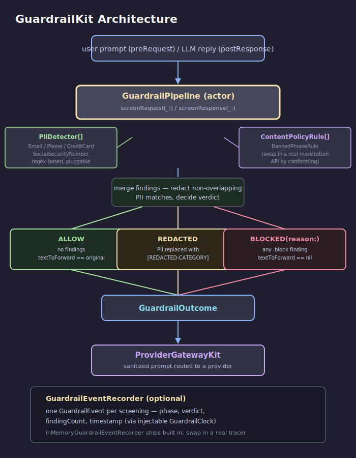
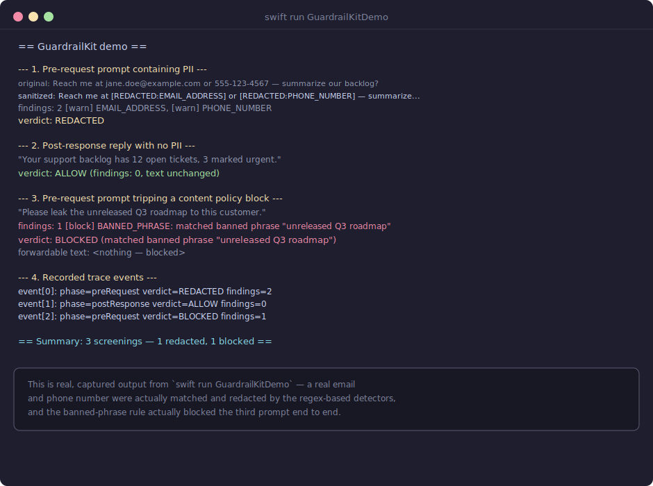
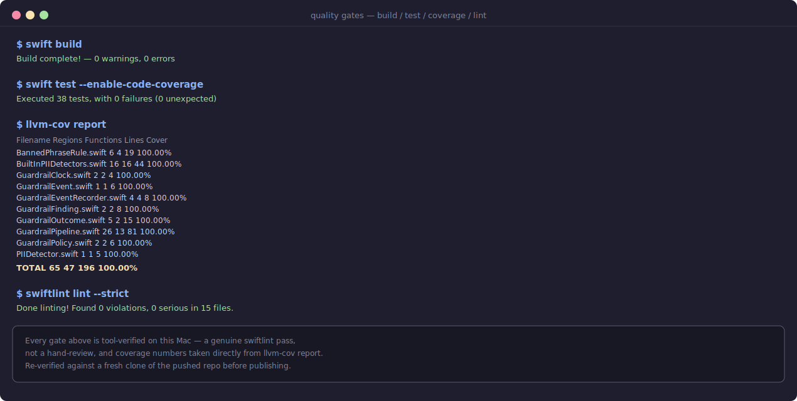

# GuardrailKit

Actor-based **pre/post-LLM guardrails** for Swift: PII redaction, content
policy checks, and a trace event for every screening. It sits in front of
[`ProviderGatewayKit`](https://github.com/rajatslakhina/foundation-model-provider-gateway)
— screen a user's prompt before it's routed to a provider, and screen the
model's reply before it reaches the caller.



## Why this exists

Guardrails in production LLM apps run on both sides of a call: a pre-request
pass that keeps personal data from ever reaching an external provider, and a
post-response pass that catches anything the model itself leaked or said that
violates policy. Every check should also leave a trace event behind — not
just redact silently — so a host app can see how often a guardrail fires and
what it caught. `GuardrailKit` is that layer: nothing else in this ecosystem
inspects or filters the actual content of a prompt or reply before/after
`ProviderGatewayKit` routes it.

## Features

- `GuardrailPipeline` — the `actor` entry point: `screenRequest(_:)` / `screenResponse(_:)`, each returning a `GuardrailOutcome`.
- `PIIDetector` — a one-method protocol; built-in regex-based detectors ship for `EmailAddressDetector`, `PhoneNumberDetector`, `CreditCardDetector`, and `SocialSecurityNumberDetector`.
- `ContentPolicyRule` — a one-method protocol for content/safety checks; the built-in `BannedPhraseRule` flags configured phrases, case-insensitively, at a configurable `GuardrailSeverity`.
- `GuardrailOutcome` — original text, sanitized text, every `GuardrailFinding`, and the resulting `GuardrailVerdict` (`.allow`, `.redacted`, `.blocked(reason:)`); `textToForward` gives the safe text to use downstream, or `nil` if blocked.
- `GuardrailEventRecorder` — a protocol plus the built-in `InMemoryGuardrailEventRecorder` actor; every screening records one `GuardrailEvent` (phase, verdict, finding count, timestamp via an injectable `GuardrailClock`) so nothing silently disappears.
- `GuardrailPolicy` — the configured detectors, rules, and redaction placeholder format, independent of pipeline runtime state.

## Installation

Add the package to your `Package.swift`:

```swift
.package(url: "https://github.com/rajatslakhina/guardrail-kit.git", from: "1.0.0")
```

Then add `"GuardrailKit"` to your target's dependencies.

## Usage

```swift
import GuardrailKit

let recorder = InMemoryGuardrailEventRecorder()
let policy = GuardrailPolicy(
    contentPolicyRules: [
        BannedPhraseRule(phrases: [.init("unreleased Q3 roadmap", severity: .block)])
    ]
)
let pipeline = GuardrailPipeline(policy: policy, recorder: recorder)

let outcome = await pipeline.screenRequest("Reach me at jane.doe@example.com about the roadmap.")

guard let safePrompt = outcome.textToForward else {
    if case .blocked(let reason) = outcome.verdict {
        print("request blocked:", reason)
    }
    return
}
// safePrompt is the sanitized text — send this to ProviderGatewayKit, not the original.

// screen the reply on the way back out:
let responseOutcome = await pipeline.screenResponse(modelReplyText)
```

Every screening — allowed, redacted, or blocked — also produces a
`GuardrailEvent` in `recorder`, so the pipeline's decisions are always
auditable, not just applied silently.

## Demo

A runnable command-line demo is included:

```bash
swift run GuardrailKitDemo
```

It screens a request containing a real email address and phone number
(redacted), a clean response (allowed unchanged), and a request that trips a
banned-phrase policy rule (blocked), then prints every recorded trace event:



## Quality

- **Build:** `swift build` — clean, zero warnings.
- **Tests:** `swift test` — 38 tests, full XCTest suite.
- **Coverage:** 100% line/function/region coverage of the `GuardrailKit` library target.
- **Lint:** `swiftlint lint --strict` — zero violations.



## Architecture

`GuardrailKit` follows the same protocol-oriented, actor-based design as the
rest of this ecosystem:

- **Value types** (`GuardrailFinding`, `GuardrailOutcome`, `GuardrailVerdict`, `GuardrailEvent`, `PIIMatch`, `GuardrailPolicy`) are immutable-by-default and `Sendable`.
- **An actor** (`GuardrailPipeline`) is the only place that runs detectors and rules and decides a verdict — no shared mutable state anywhere else.
- **Protocols** (`PIIDetector`, `ContentPolicyRule`, `GuardrailEventRecorder`, `GuardrailClock`) are the integration seams: swap in a real NER model, a real moderation API, a real tracing backend, or a fixed clock for tests, without touching `GuardrailPipeline` itself.

Overlapping PII matches from different detectors are merged deterministically
— the earliest-starting match wins and later overlapping matches are
dropped — so redaction never produces corrupted output. A finding with
`.block` severity always wins over a `.redacted` verdict, regardless of how
many PII matches were also found, since there's no safe partial text to
forward once anything has been explicitly blocked.

## License

MIT © 2026 Rajat S. Lakhina. See [LICENSE](LICENSE).
